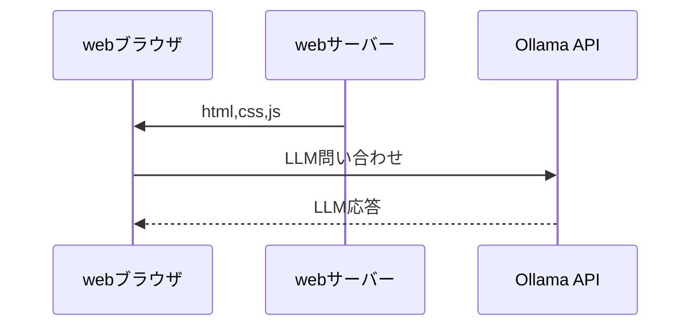

# VueOllamaChat

ionic vue を使った ollama のチャットアプリケーションのサンプルです。

# ライセンス

このプロジェクトは [MIT License](https://opensource.org/licenses/MIT) のもとで公開されています。  
詳細はリポジトリ内の [LICENSE](./LICENSE) ファイルをご確認ください。

依存パッケージ（Ionic Vue, md-editor-v3 など）は `package.json` に記載されており、  
それぞれのライセンスに従って使用されています。これらの依存関係は `npm install` により取得され、  
プロジェクトに直接バンドルはされていません。

# 構成図


* このプロジェクトに ollama api のサーバーは含まれません。
* webブラウザは python のwebサーバーから ionic vue のhtml,css,js を取得します。
* webブラウザは、webサーバーと同じサーバーで動いている(ポートは異なる11434) ollama のAPIに接続します。

# シーケンス



# 環境

## ディレクトリ構造

```
├── README.md
├── doc
│   └── blockDIagram01.drawio.svg
└── vueollama <-- ionic vue のプロジェクト
    ├── capacitor.config.ts
    ├── cypress.config.ts
    ├── index.html
    ├── ionic.config.json
    ├── package-lock.json
    ├── package.json
    ├── public
    │   └── favicon.png
    ├── src
    │   ├── App.vue
    │   ├── components
    │   │   └── selectModel.vue <-LLMモデル選択component
    │   ├── main.ts
    │   ├── router
    │   │   └── index.ts
    │   ├── theme
    │   │   └── variables.css
    │   ├── views
    │   │   └── HomePage.vue <- ほとんどここ
    │   └── vite-env.d.ts
    ├── tsconfig.json
    ├── tsconfig.node.json
    └── vite.config.ts
```
## ollama api サーバー

ollama の api サーバーが webサーバー(もしくはvuejs開発サーバー)と同じサーバーの 11434 ポートで動作している
想定で動作します。chatなどのLLM問い合わせ先が webサーバーの11434ポートに接続します。

ollama の api サーバーの構築は https://github.com/ollama/ollama を参考にしてください。

Linux の場合、以下の手順で ollama api サーバーを動作させることができます。

* https://github.com/ollama/ollama/releases から最新のリリースをダウンロードし、解凍します。
  * 自分の利用している OS のアーキテクチャに合わせて適切なファイルを選択してください。
* Linux の場合、　展開したディレクトリの binにある ollama を実行します。
  * 展開ディレクトリ/bin/ollama
  * 上記方法はOS起動後毎回行う必要があります

## python webサーバー

現状は, python の webサーバーは未実装

## vuejs(ionic vue)

static な html,js,css を提供するための vuejs プロジェクトが vueollama ディレクトリにあります。

現状はここで、 npm run dev ( もしくは yarn dev) で開発サーバーを起動して動作確認を行っています。

### nodejs 環境

* nodejs: 20.18.0 : 確認を行った環境。他の環境でも動作するはずです。
* npm (もしくはyarn)

### 依存パッケージのインストール

開発の開始時は必要なパッケージをインストールするために

```
npm install
もしくは
yarn install
```
を行ってください。

このプロジェクトは Node.js 環境で動作し、依存パッケージは `npm install` により自動的に取得されます。

使用している依存パッケージのライセンスは、それぞれのパッケージに従います。

### 開発サーバー start
```
npm run dev
もしくは
yarn dev
```

### ビルド

```
npm run build
もしくは
yarn build
```

dist 以下に build 結果が出力されます。
